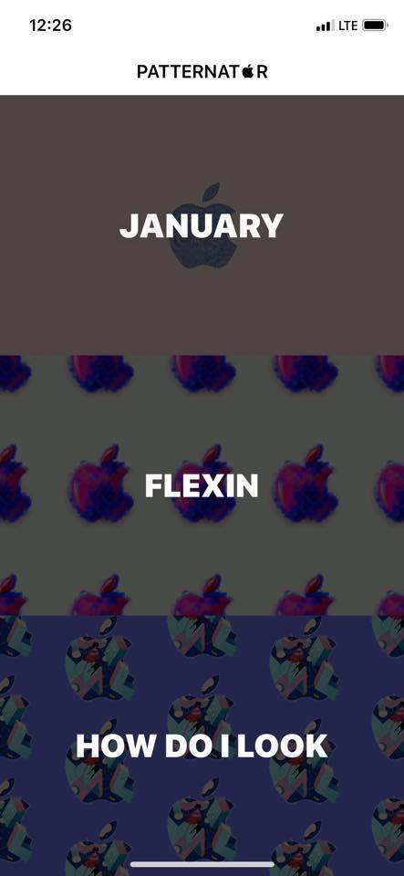
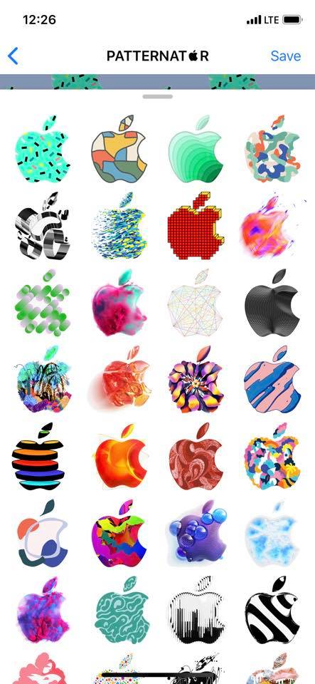
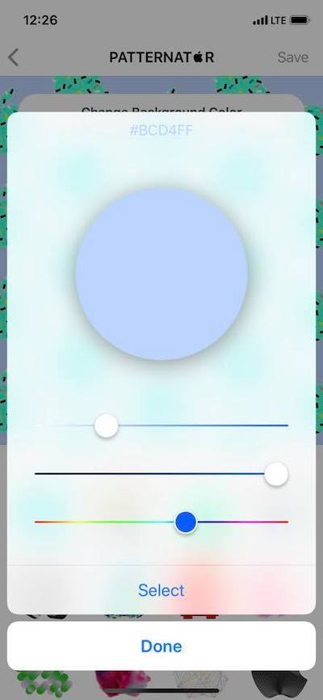
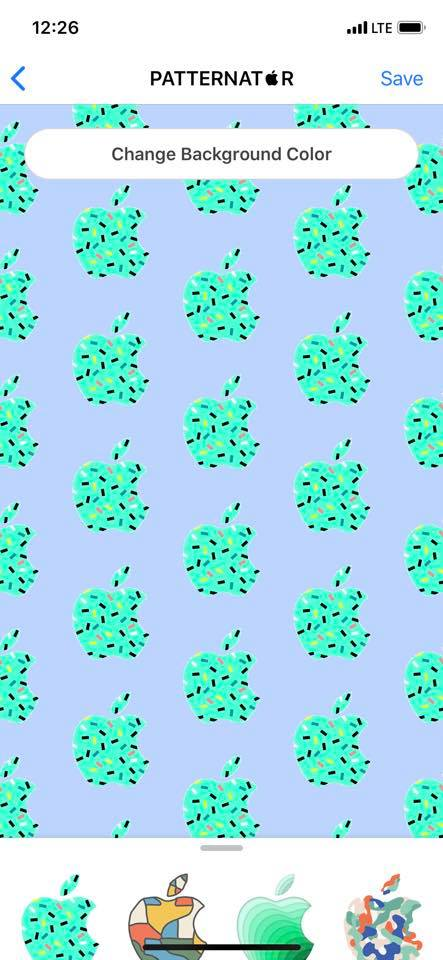

# Patternatr

Patternatr is wallpaper maker with more than 370 apple logos!

| 1. Select Wallpaper Type  | 2. Select Favorite Logo | 3. Select Suitable Color | 4. Tada 🎉 |
| ------------- | ------------- | ------------- | ------------- |
|   |  |  |  |

## Release History

* 1.0.0
    * CHANGE: Hello World (Make wallpapers with 370 images)

## Contributing

1. Fork it (<https://github.com/pilgwon/Patternator/fork>)
2. Create your feature branch (`git checkout -b feature/fooBar`)
3. Commit your changes (`git commit -am 'Add some fooBar'`)
4. Push to the branch (`git push origin feature/fooBar`)
5. Create a new Pull Request

## Thanks To

Sticker Images by [AppleEventInviteStickerPack](https://github.com/azzoor/AppleEventInviteStickerPack)

Inspired by [Patternator](http://www.patternator.me)

